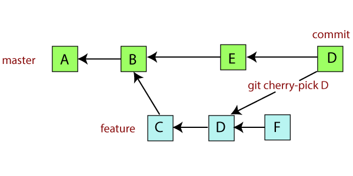

# SDV502VersionControl
Version control github activity

<br />

### Git Cherry-Pick:<br /> 
Git cherry-pick applies changes made some existing commits.

```markdown
git cherry-pick
```
<br />

</p>
<p align="center"> 

</p>

<br />

### Unstaging/Undo:<br /> 
How to unstage files using git..
<br />
Some commands that are useful are..
<br />

```markdown
git reset HEAD <file>
```
This removes files from staging, HEAD is the last commit of the branch.
this keeps the file but keeps the modifications.
<br />

```markdown
git checkout -- <file>
```
Revert the file back to state before changes were made 

<br />

```markdown 
git rm `*.txt`<br />
git rm -r <directory name>
```
To remove a file from disk and repo use git rm, to remove a directory use the -r flag.

<br />

```markdown
git rm <filename> --cache
```
If we want to remove a file from the repository but keep it on disk, If you forgot to add it to your .gitignore file then use --cache

<br />

</p>
<p align="center"> 

</p>

<br />

### Unmodifying 

<br />

If you require to undo some changes made, here are some commands.

<br />

```markdown
git commit --amend
```

this command takes the staging area and uses it for the commit, if you run this command after your commit, then the snapshot will be the exact same, and all that will change is the commit message.

<br />

```markdown
git rebase 
```
<br />
</p>
<p align="center"> 

</p>

<br />

Git rebase is the process of moving or combining a sequence of commits to a new base commit. the branch will look the same but with new commits. 

<br />

### Stashing

```markdown
git stash
git stash list
git stash apply
```
<br />
This allows you to stash changes, these changes are sent to a stack, this then allows you to switch branches and work elsewhere without commiting your work.
<br />

</p>
<p align="center"> 

</p>

### Clean

<br />

```markdown
git clean
```
<br />
Git clean allows to remove untracked files from the work tree
<br />

### branching workflow

```markdown
git checkout <branch/master>
git fetch origin
git reset --hard origin/master
```
<br />

</p>
<p align="center"> 

</p>

<br />

git checkout origin: <branchname/master> Git checkout allows you to switch branches or restore working tree files.

Git fetch <orign>: This command downloads content from a remote repo

